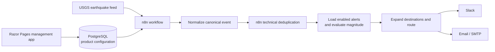

# Sonrisa alerts

Sonrisa is an MVP for configuring earthquake-magnitude alerts and delivering matching notifications through Slack and Email. The management application stores alert configuration; an existing shared DEV n8n instance processes events and dispatches notifications.

**Status:** the delivered MVP has one inactive, manually operated n8n workflow with Slack and Email branches. The final end-to-end validation is recorded in [the evidence](evidence/reviews/2026-09-14-end-to-end-validation.md).

## Final architecture



The Razor Pages application provides owner-aware alert and destination management plus read-only, cross-owner product configuration views at `/admin`, `/admin/users`, and `/admin/alerts`. It has no authentication or authorization; the configured owner is an MVP development mechanism, not a security boundary.

PostgreSQL stores only product configuration and EF Core migration history: owners, alerts, deterministic magnitude conditions, and non-secret Slack/Email destinations. It is not a workflow queue, event ledger, retry store, or delivery ledger. n8n owns canonical event processing, bounded technical deduplication, execution history, transport retries, credentials, and runtime diagnostics. [ADR-012](docs/adr/ADR-012-use-n8n-native-runtime-state.md) records this deliberately simplified architecture.

## Technology

- ASP.NET Core 10 / Razor Pages, EF Core and Npgsql
- Tailwind CSS 4.3.3
- PostgreSQL shared DEV product database
- n8n shared DEV runtime (2.38.7 recorded during runtime validation)
- Slack and native SMTP Email transports
- OpenTelemetry logs and ASP.NET Core request traces

## Quick start

Use .NET SDK **10.0.401** (or its permitted later patch) and Node **24** with npm **11**. The validated tools were .NET runtime 10.0.12, Node 24.21.0, and npm 11.19.0.

```bash
dotnet tool restore
npm ci
npm run css:build
dotnet build Sonrisa.sln
dotnet run --project src/Sonrisa.Web
```

The Development host listens on [http://localhost:5180](http://localhost:5180). It starts without a database connection. Configure `ConnectionStrings:ProductDatabase` through User Secrets, or supply the externally managed `ConnectionStrings__ProductDatabase` environment variable, to use the shared DEV product database. Do not put connection values in tracked files. See the [runbook](docs/08-runbook.md) for safe configuration, health checks, migrations, Docker, Tailwind, telemetry, and troubleshooting.

Verify the host:

```bash
curl -i http://localhost:5180/health/live
curl -i http://localhost:5180/health/ready
```

`/health/live` checks only that the application can serve requests. `/health/ready` tests PostgreSQL connectivity and returns 503 for missing, malformed, unavailable, or stalled configuration.

## Reviewer demo

1. Start the management application and open `/alerts` and `/settings/notifications` to view or configure the current MVP owner's product settings. Open `/admin` for cross-owner configuration summary without destination values.
2. Inspect the authoritative sanitized workflow at [n8n/workflows/process.json](n8n/workflows/process.json) and its [operations guide](n8n/README.md). The hosted DEV workflow remains inactive.
3. For a deterministic no-send check, construct the fixture SDK representation locally:

   ```bash
   node n8n/build-workflow.mjs process --fixture earthquakes.json
   ```

   This does not import, activate, execute, or send a notification. The actual workflow's fixture mode and controlled transport mocks were used only during recorded validation; a manual n8n run can send.
4. Review [end-to-end evidence](evidence/reviews/2026-09-14-end-to-end-validation.md): real USGS reading with transports suppressed, native duplicate and retry behavior, historical Slack provider acceptance, and one controlled SMTP4DEV capture.

## Testing and validation

Run the current local checks:

```bash
dotnet test Sonrisa.sln
node --test n8n/tests/*.test.mjs
```

Without explicit guarded test-database configuration, relational .NET tests intentionally skip. The prior integrated validation ran all guarded cases and recorded **83/83 .NET** and **24/24 Node** tests, along with real application, PostgreSQL, and workflow checks. This documentation milestone's current checks are reported separately in [final documentation evidence](evidence/reviews/2026-09-15-final-documentation.md); historical runs are evidence, not a claim that external systems were re-executed.

## Known limitations

- Authentication and authorization are not implemented.
- The n8n workflow is inactive; there is no unattended schedule.
- Deduplication is n8n node/history-scoped, bounded, and not a permanent or globally atomic physical-earthquake ledger. Changed USGS identifiers, lost history, or concurrent runs can permit duplicates.
- Notifications are best effort: Slack and Email receive five total native attempts, then an exhausted item is discarded. Ambiguous provider failures can lose or duplicate a notification.
- Deduplication happens before configuration reads and sending: downstream failures can permanently lose notifications, and new/edited alerts do not rematch seen events.
- SMTP4DEV proves SMTP submission and capture only; it does not prove external internet-mail delivery.
- The current DEV database credential/TLS posture is an accepted DEV exception, not production validation.

## Repository guide

| Path | Purpose |
| --- | --- |
| [src/Sonrisa.Web](src/Sonrisa.Web) | Razor Pages application, configuration persistence, health and observability. |
| [tests/Sonrisa.Web.Tests](tests/Sonrisa.Web.Tests) | Application and guarded PostgreSQL tests. |
| [n8n](n8n) | Workflow source, tests, sanitizer/exporter, final artifact and runtime operations. |
| [docs/08-runbook.md](docs/08-runbook.md) | Practical development and operator runbook. |
| [docs](docs) | Product brief, architecture, scope, contracts, decision log, review log and retrospective. |
| [docs/adr/README.md](docs/adr/README.md) | Architecture decisions and supersession history. |
| [evidence/README.md](evidence/README.md) | Validation and review evidence. |
| [prompts](prompts) | Preserved substantive user task requests. |

Start with [architecture](docs/04-architecture.md), [runtime contract](docs/07-runtime-contract.md), [validation strategy](docs/05-validation-strategy.md), [AI review log](docs/ai-review-log.md), and [final reflection](docs/final-reflection.md) for the reasoning and evidence behind the MVP.
