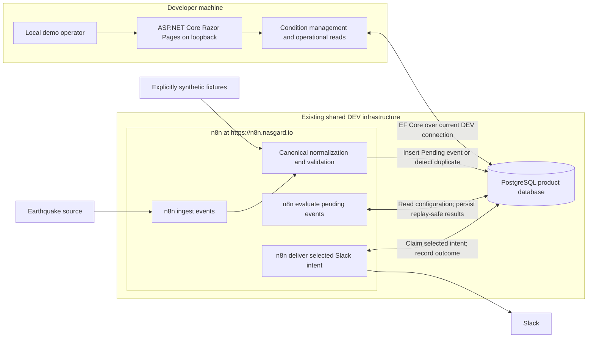

# MVP architecture

This is the current architecture, amended by [ADR-011](adr/ADR-011-use-n8n-evaluation-and-replay-safe-runtime-writes.md) for milestone 5. The [approved specification](superpowers/specs/2026-09-14-first-runtime-design.md) defines a minimal USGS-to-Slack slice; the [reviewed plan](superpowers/plans/2026-09-14-first-runtime.md) and evidence distinguish implementation from validation. The application manages configuration; n8n owns runtime processing through the product database. No n8n/application HTTP integration exists. Retry/circuit sections below describe deferred milestone-6 direction, not capabilities of the first slice.

## Product and runtime shape

The single MVP operator configures an enabled earthquake alert with a magnitude threshold and a shared notification profile containing an email destination, Slack destination, or both. n8n ingests events, evaluates supported conditions, records durable notification intent, and delivers one explicitly selected Slack intent. Automatic retries, circuit breaking and email execution remain milestone 6. The operator will see events and delivery outcomes in the later operational surface. Additional event types reuse the same supported contract and processing stages.

Run the ASP.NET Core/Razor Pages application locally on the developer machine, directly or in the requested application-only Docker container with loopback host publishing. Use the existing shared DEV PostgreSQL server for the product database and the existing n8n runtime at `https://n8n.nasgard.io`. Do not provision local PostgreSQL or n8n. Hosted n8n owns its internal persistence entirely outside this repository; its storage is not part of the application database design. EF Core migrations own only the product schema. Confirm compatible application/provider versions and secure product-database connectivity during skeleton implementation; inspect n8n capabilities when relevant without changing shared service configuration. The service locations are user-confirmed, not connectivity test results.

The diagram shows the approved first-slice responsibilities. All three workflows remain inactive, with manual execution for validation. Ingestion, evaluation and delivery have independent recovery boundaries. No generic workflow engine, broker, distributed cache, or extra worker service is needed.

## Responsibility and database access

| Component | Responsibility | Access boundary |
| --- | --- | --- |
| Razor Pages/application services | Create/edit/enable/disable user conditions, validate configuration, scope all alert operations to the configured owner, and render operational data. | Reads/writes configuration; reads workflow-owned event/delivery state. No event evaluator, delivery scheduler, or circuit state machine in application code. |
| n8n ingestion | Poll the selected source, normalize/validate canonical data, and persist previously unseen events. | Dedicated runtime credential for product SQL; external credentials use n8n's credential system. |
| n8n evaluation | Read active conditions, evaluate the supported typed rule, create unique delivery intent, and complete event processing. | A joined configuration read, n8n evaluation, idempotent intent write, and separate event completion. No SQL business matcher or event-wide transaction. |
| n8n delivery | Require one explicit Slack intent ID, conditionally claim it, send once, and persist the outcome. Automatic queue draining/retries and email are deferred. | Workflow-owned logic and operational records. Application database storage does not imply application behavioral ownership. |
| Product PostgreSQL database | Configuration, canonical events, Pending/Evaluated state, and minimal delivery intent/outcome records. Attempts and circuits are future work. | EF migrations own schema. n8n runtime can read configuration and read/write operational records; it cannot alter schema or user conditions. |

Use distinct least-privilege migration, application-runtime, and n8n product-workflow roles for the product database. [ADR-007](adr/ADR-007-accept-current-dev-database-access.md) permits the currently supplied application administrative credential for DEV only; production retains the restricted-role requirement. Outside that explicit DEV exception, runtime roles receive no schema-owner or superuser privileges; EF migration access is separate. Hosted n8n internal storage and its credentials are outside repository design, setup, and validation. Explicit column projections, parameterized values, and database constraints form the integration contract. Review every breaking schema change with the affected workflow queries. Do not build a duplicate application API for symmetry.

## Management, ownership, and destinations

Use one configured/default MVP owner resolved inside the application under [ADR-008](adr/ADR-008-use-single-configured-mvp-owner.md). No identity selector, pre-created roles, login, authentication, or authorization infrastructure is part of this MVP. Stable alert ownership and owner-scoped management queries prepare persistence for future authenticated users; they do not authenticate the current operator or establish a security boundary. Never bind the owner from form input. Future authentication replaces the current-owner resolver and maps authenticated subjects to the existing ownership concept.

Keep the management UI on loopback, directly or through the application-only container. This MVP/development access constraint follows deployment purpose, not merely the ASP.NET environment name. The hosted n8n editor keeps its existing external access controls. ADR-007 retains the accepted current DEV administrative database credential and observed PostgreSQL TLS limitation; restricted roles and secure transport remain production requirements.

The management surface lists the configured owner's alerts and supports creation, editing, and enabling/disabling. Validate ownership on each operation. An alert has an owner, name, enabled flag, event type, one supported field/operator/typed-value condition, and ownership referencing shared user notification settings. The initial supported rule is earthquake magnitude greater than or equal to a finite numeric threshold. Do not invent scientific range limits or restrict the configured threshold to provider-side feed filters. Reject unsupported fields/operators, invalid values, and profiles without any destination.

Use one runtime-configured Slack workspace/profile and one email sender/profile. Under ADR-010, the user edits a shared email destination, Slack destination, or both through notification settings; PostgreSQL stores them in users, joined through alerts.owner_id. Every alert uses that profile, with no per-alert channel selection. Credentials and arbitrary URLs are not user rule fields. Destination allowlists in application configuration are removed; transport onboarding and multi-workspace OAuth remain deferred. Validate and escape display/message text; source content cannot become HTML/script, executable SQL, or agent instructions. Use normal form anti-forgery protection even in the local UI.

Disable rather than hard-delete alerts so historical deliveries remain inspectable. Changes affect later evaluation; already committed event/destination snapshots do not silently change. No historical rematching UI or mass replay is included.

## Canonical event and rule contract

The canonical envelope follows ADR-002. The first-slice specification fixes concrete limits and the USGS mapping:

| Field/concept | Meaning |
| --- | --- |
| Contract version | One supported version initially; unsupported input is rejected, not guessed. |
| Source key | Stable configured provider identity, separate from event type. Demo sources use a reserved namespace. |
| External event identifier | Nonempty selected provider ID; source plus external ID is unique. USGS preferred IDs may change, so this is not physical-earthquake identity. |
| Event type | Initially earthquake. A redundant category hierarchy is unnecessary for one type. |
| Occurrence time | Required timestamp with an explicit UTC interpretation. |
| Title | Required bounded plain-text display title. A summary is optional; exact size bounds are input-contract configuration before implementation. |
| Source URL | Optional validated HTTP(S) reference for display, never an arbitrary fetch instruction. |
| Type-specific data | Validated earthquake magnitude as a finite number. Wire/storage JSON is allowed, but only supported typed fields may be used by conditions. |
| Received time and processing status | Set by the workflow/database boundary, never trusted from external content. |
| Synthetic marker | Derived from a reserved demo source/profile and shown in UI/notifications. It cannot be silently mixed with a live-source claim. |

Reject malformed or unsupported input before accepting an event; missing magnitude is not zero and must not accidentally match. For the supported contract, configure explicit payload/text bounds before implementing ingress. This is validation work, not permission to select a large schema framework.

Separate provider normalization from event semantics. Another earthquake provider maps to the same canonical type and condition. A new type declares its validated fields and allowed comparisons. A new business meaning, such as price movement over a time window, may need additional code/query logic. There is no arbitrary JSONPath, nested boolean language, or configuration-only promise for future domains. [ADR-002](adr/ADR-002-canonical-events-and-typed-alert-conditions.md) retains the extension rationale; ADR-005 replaces its original runtime ownership.

**Accepted first-snapshot behavior:** retain the first valid accepted snapshot for a source/external identifier. Repeated polling, including changed provider content under that identifier, does not create a second event or re-evaluate a completed one. This follows the user's new-event flow and deliberately defers provider correction/retraction semantics. It can miss a later magnitude correction crossing the threshold; disclose this limitation in the demo and revisit before use where revisions matter. Different providers reporting the same occurrence are not cross-source deduplicated.

**Rule timing:** each evaluation attempt reads joined enabled-alert/user configuration in one statement snapshot. Replays and overlapping attempts can read later configuration and accumulate unique intents from those reads; event-wide atomic configuration consistency is not promised. A committed intent remains after later alert disable and retains its original destination. Completed events are not rematched. The first USGS poll accepts the current one-hour feed without archive/backfill or a cursor. No intent is automatically sent.
## Three recoverable workflow responsibilities

### 1. Ingest events

Manual live entry → fetch the public [USGS all-hour GeoJSON feed](https://earthquake.usgs.gov/earthquakes/feed/v1.0/summary/all_hour.geojson) → normalize/validate → insert unique Pending events. An explicit manual fixture entry uses a reserved `demo.usgs` source and the same normalizer. A future five-minute schedule must enter only the live branch; it is not activated in this milestone.

`UNIQUE(source, external_id)` and `ON CONFLICT DO NOTHING` retain the first snapshot. An existing Pending event remains available to evaluation. Malformed individual records produce diagnostic skips while valid records survive; malformed top-level data and source/database failures fail visibly. USGS documents that preferred IDs may change. Alias-aware resolution was investigated and deliberately deferred; repeated observations of an unchanged ID are deduplicated, but provider renaming can create another event. Source updates under the same ID do not change magnitude or trigger rematching.

### 2. Evaluate pending events

Each manual invocation obtains one Pending event and a joined snapshot of relevant enabled alerts and their shared owner destinations, across all owners. The application’s `MvpOwner:Id` does not participate. The query preserves one event envelope with an empty alert list when nothing is enabled.

A focused n8n Code node interprets only textual `earthquake`, `magnitude`, `gte`, `number` and finite numeric values. It evaluates magnitude greater than or equal to threshold; unknown or malformed configuration produces no match and a safe diagnostic. PostgreSQL does not evaluate the condition.

A parameterized intent insert uses `UNIQUE(source_event_id, alert_id, channel)` and snapshots the destination. It returns a completion summary even for zero matches. Only after successful persistence does a separate statement mark the event Evaluated. Failure leaves Pending available for replay; previously committed intents are retained without duplication. This is intentionally simpler than an atomic SQL matcher and does not provide an event-wide immutable rule snapshot across replays. No external send occurs inside evaluation.

### 3. Deliver one selected Slack intent

A manual entry requires one explicit UUID; empty/invalid input fails before access or send. A conditional update claims only that `pending` Slack intent as `processing`. Missing, already claimed, sent, failed and email intents cannot pass the claim gate. There is no automatic pending-delivery scan.

The message uses immutable canonical event data and domain IDs, with a synthetic marker where applicable; the destination comes from the intent snapshot and credentials from n8n. Disable native send retries. One accepted Slack response may be recorded as `sent`; this proves provider acceptance, not human receipt. A known rejection is `failed` with a bounded diagnostic code. An uncertain network result or a crash after Slack acceptance leaves `processing`, possibly with an outcome-unknown code, and is not automatically retried. `unsupported` email intent is visible and never selected for Slack.

There is no exactly-once external delivery guarantee. Start any re-execution at the explicit-ID claim entry, never replay a saved Slack node with its old inputs. Do not manually reset an ambiguous record without investigation. A future retry policy must explicitly handle uncertainty and possible duplicates.

## Deferred delivery/reliability architecture — milestone 6

The remaining sections retain the accepted broader delivery direction from ADR-005. They are design inputs for a separately reviewed milestone-6 plan; no attempt, token/lease, circuit, backoff or automatic recovery state is introduced in milestone 5.

### Deliver pending notifications in the later milestone

Independently schedule due Pending notifications. n8n reads and updates its operational delivery/circuit records directly in the product database; no application authorization, HTTP claim/callback, retry code, or circuit code participates.

| Delivery state | Meaning |
| --- | --- |
| Pending | Persisted intent waiting for its due time and an available transport circuit. |
| Processing | A bounded attempt holds an ownership token/lease. |
| Sent | A successful external transport acknowledgement has been durably recorded. It does not prove inbox placement or human receipt. |
| Failed | A permanent message/destination problem requires operator correction; the record remains inspectable. |

Claim a due delivery and profile permission atomically, using a stable attempt identity generated before the database call. At most one unexpired leased attempt per transport profile is sufficient for the demo. This is a logical ownership limit, not a guarantee that an expired slow external send has physically stopped. Select due work by next eligibility and stable creation order so a repeatedly failing item does not starve other due deliveries. Commit the claim before the external send, which must have a bounded timeout. Persist the attempt outcome and delivery/circuit transition atomically afterward. Do not hold a SQL transaction open across a network call.

Database retries repeat the same operation identity. A lost claim response must not allocate unrelated extra work. A retried success write must not send the message again. The actual transport node performs one send per attempt; disable independent send-node retries and route later attempts through the workflow gate. Every recovery path, including error workflows and manual execution retries, must return through the persisted claim gate. Do not replay an old send node with saved inputs as a fresh attempt.

Recover expired leases as uncertain outcomes in subsequent scheduled delivery runs. Expiry can mean n8n stopped before sending, so it does not increment a Closed circuit's dependency-failure count. A reported transport timeout/unavailability may count; an expired Half-open probe instead follows the separate conservative reopen rule. Retry uncertain or transient external failures with capped backoff; the user explicitly accepts possible duplicate messages. Sent is monotonic: a delayed success can prevent future attempts but cannot retract a newer external send already in flight. Stale failures cannot overwrite a recorded success or alter a newer probe. Preserve attempt history with sanitized errors and provider references where available.

Permanent destination errors fail that delivery without blocking other destinations. Shared dependency failures affect the corresponding circuit. Operator recovery is performed through a bounded n8n maintenance workflow/runbook after correction, reusing the existing delivery identity; the application admin remains observational. No record is silently deleted or expired because its provider is down.

## Workflow-owned circuit breaker

Persist the circuit state in workflow-owned operational records in the product database, separate from alert configuration. EF migrations may create these records' schema, and the admin may display them; all state-machine behavior remains in n8n workflows. Hosted n8n internal persistence is outside the product contract; neither that storage nor per-execution memory is the source of truth for product circuit state.

Scope the circuit to a configured transport profile, initially one Slack workspace/credential profile and one email sender profile. Opening Slack must not open email. Use a small state machine:

- **Closed:** eligible attempts proceed; count consecutive qualifying dependency failures.
- **Open:** preserve Pending deliveries and do not call the provider before recovery time. Waiting consumes no send attempt.
- **Half-open:** atomically permit one actual due delivery as a probe. A successful send closes/reset the circuit; a qualifying failure or expired uncertain probe reopens it.

Each attempt updates circuit accounting at most once. Use profile ownership/probe identity so late outcomes cannot close or reopen a newer circuit generation. Rate limits respect Retry-After when available. Authentication/configuration failures for a shared profile pause it for correction and controlled later probing. A permanent destination rejection is a neutral health outcome: fail that delivery, release the probe, keep Half-open without an active probe, and let the next eligible delivery probe. It neither closes the circuit nor leaves its probe slot occupied. If no delivery is due, Half-open simply waits; it holds no lease or database transaction.

This adapts the [Circuit Breaker pattern](https://learn.microsoft.com/en-us/azure/architecture/patterns/circuit-breaker) to workflow-owned state. It introduces no Azure service or mandatory resilience package. [n8n Retry On Fail](https://github.com/n8n-io/n8n-docs/blob/main/docs/integrations/builtin/handle-rate-limits.md) repeats a request, so enabling it blindly on transport nodes would bypass the shared gate.

### Proposed local defaults, not product SLAs

| Setting | Initial demo value | Reason/constraint |
| --- | --- | --- |
| Failure threshold | 3 consecutive qualifying dependency failures | Small deterministic circuit demonstration; not inferred from measured traffic. |
| Open cooldown | 60 seconds, or longer provider Retry-After | Avoid immediate repeated calls to a failing dependency. |
| Half-open concurrency | 1 probe per profile | Bound recovery and make concurrent scheduling testable. |
| Transport call timeout | 30 seconds | Must be enforced by the selected node/provider integration. |
| Attempt lease | 120 seconds | Must exceed bounded send duration plus outcome-write allowance. Revalidate against actual node behavior. |
| Delivery retry delay | 5 seconds, doubling to a 300-second cap | Deterministic backoff; circuit and provider delays take precedence. |
| Evaluation/delivery scheduling | Every 10 seconds for the local demo | Recovery progresses without new source events. Source polling has its own provider-dependent cadence. |

Transient/uncertain retries have no arbitrary terminal attempt count in this design; capped delay, bounded concurrency, and the circuit control repeated calls. Permanent failures remain visible. These are configurable engineering assumptions for implementation/review, not guaranteed delivery latency or a promise that unavailable services eventually recover. The user's five-send example expressed duplicate tolerance, not a numeric retry limit.

## Operational admin and deterministic demo

The admin surface shows recent events and processing state, linked deliveries, attempts/errors, next retry eligibility, and circuit state/recovery time. Display occurrence time and synthetic markers. Show n8n execution references where recorded, but do not replicate its workflow debugger or imply that an old last-event timestamp proves source failure.

Use controlled synthetic canonical events through the same normalization/validation and persistent processing boundary as real source data. Reserve synthetic source IDs, use distinct IDs per demo case, and restrict injection to an explicit operator-controlled manual entry in this project's n8n workflows. Keep this project's live ingestion disabled during deterministic runs and use only explicitly authorized isolated email/Slack destinations. Replay the same synthetic ID to prove deduplication; use a new ID to demonstrate another legitimate notification. No direct database insertion of finished matches or Sent records is a demo shortcut.

Retain product events, attempts, and delivery identity for the demo until an explicit operator reset of the isolated demo dataset. No automatic retention cleanup is included, because deleting deduplication keys could permit resend on replay. Hosted n8n execution retention is externally managed and outside this repository; product state remains authoritative. Any future demo reset must target only an explicitly isolated product dataset and leave unrelated shared DEV data and workflows untouched. Long-running retention, expiry of stale notifications, and production operational budgets remain future decisions.

## Configuration and remaining integration decisions

Connection-string values are absent from tracked files, including examples, migrations/helpers, prompts, logs, and exports. Application runtime and EF tooling use User Secrets locally. The requested application-only Docker option loads runtime settings from an ignored `.env`; shared PostgreSQL/n8n remain external. Future n8n product-database and notification credentials use its credential store; internal-storage credentials are outside this repository's scope. In the skeleton, missing or invalid product-database settings leave the shell and liveness running while readiness reports Unhealthy. Missing settings produce a startup warning naming the key; connection failures use sanitized health descriptions. There is no embedded fallback or secret-bearing diagnostic.

Provider selection, usable stable IDs and feed window, polling quotas, sender/workspace setup, transport error mapping, and compatible supported versions must be verified in their implementation milestones. The DEV service topology is selected under ADR-006. The skeleton specification pins compatible application packages; [the validation record](../evidence/reviews/2026-09-14-skeleton-review.md) distinguishes actual MCP connectivity from application readiness. USGS is selected for the first slice. Runtime credential binding, actual execution and authorized Slack validation are tracked in milestone evidence; selection alone is not a connectivity or delivery claim.

## Implemented configuration boundary

The management model uses explicit `public.alerts` and `public.users` tables. One required inline earthquake/magnitude/gte/number condition and a finite native double-precision value keep the initial contract small. `owner_id` is a stable UUID from `ICurrentOwner`; all management queries and mutations filter by it. One configured/default owner supports the single-user MVP, without authentication or a security boundary. Future authentication resolves authenticated subjects to those existing ownership identifiers. The minimal users table stores shared notification settings required now under ADR-010. No demo selector or role infrastructure exists.

Explicit FluentValidation validators check names, typed thresholds and shared email/Slack settings. Each alert or user-profile save commits in one EF transaction and checks its own opaque revision token for stale edits. There is no management delete. See [the database contract](06-alert-configuration-contract.md) for exact columns, codes, invariants and the future n8n SQL projection. n8n must read a consistent statement snapshot; shared durable state does not make separate reads atomic or propagate synchronous trace context.

Razor Pages and a build-only Tailwind CLI provide the minimal UI. [ADR-009](adr/ADR-009-use-opentelemetry-logs-and-request-traces.md) establishes ILogger/OpenTelemetry logs and request traces with optional OTLP export, no telemetry readiness dependency and no metrics/platform requirement. Current Npgsql database spans are deferred for SQL/exception privacy. See [milestone evidence](../evidence/reviews/2026-09-14-alert-configuration-validation.md) for actual checks and remaining limits.
