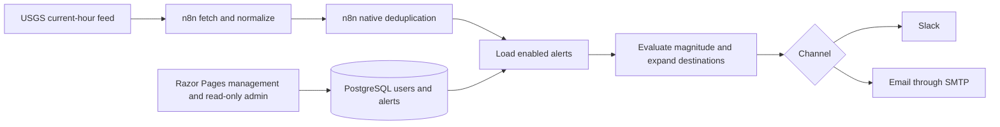
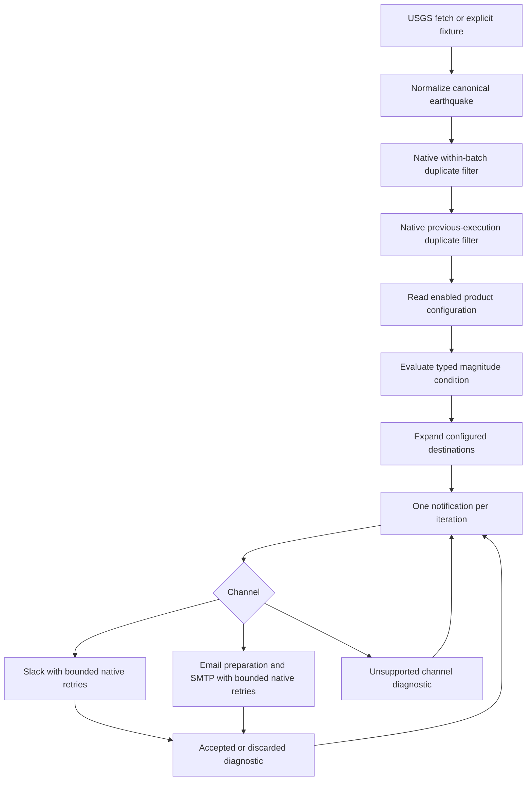

# System architecture

The current boundary is [ADR-012](adr/ADR-012-use-n8n-native-runtime-state.md), accepted after the explicit runtime course correction. The earlier three-workflow/database-state design was implemented at `b9cf171` and extended with SMTP at `e1dc337`; historical ADRs, commits and validation preserve that sequence. The [approved specification](superpowers/specs/2026-09-14-runtime-simplification-design.md) defines this correction.

## Final system at a glance

The application manages product configuration. n8n owns the runtime path and its operations. For setup and operation, use the [runbook](08-runbook.md); for historical decisions, use the [ADR status index](adr/README.md).

## Responsibilities

| Component | Owns |
| --- | --- |
| ASP.NET Core / Razor Pages | Owner-scoped configuration management, read-only cross-owner product visibility, validation, revision checks and application telemetry. |
| Sonrisa PostgreSQL | Product configuration: users, ownership, alerts, one typed condition, shared non-secret notification destinations; EF migration history. |
| n8n | Source polling, canonical normalization, technical deduplication, matching, channel routing, bounded transport retry and execution history. |

The application runs locally, directly or in its application-only container. Existing shared DEV PostgreSQL and `https://n8n.nasgard.io` remain externally operated under ADR-006. Do not provision service instances or manage n8n internal persistence. n8n reads product configuration directly; there is no application HTTP runtime API, background matcher, delivery service or processing worker.

## Configuration and ownership

The actual model has `alerts` with a required owner, name, enabled flag, revision, inline textual condition descriptors and a numeric threshold column, and `users` with shared email/Slack destinations and revision. The initial condition is `earthquake` / `magnitude` / `gte` / `number`; thresholds are finite binary64 numbers. ADR-010's shared per-user destinations and the [configuration contract](06-alert-configuration-contract.md) remain unchanged. Do not introduce a separate channel table for theoretical extensibility.

The management application resolves one configured/default owner under ADR-008 and scopes all management reads/writes to it. Authentication is intentionally absent; the resolver is not an authentication boundary. n8n loads enabled alerts across owners using their user-profile join, without reading `MvpOwner:Id`. Normal management retains that owner boundary. The separately authorized read-only admin pages intentionally expose cross-owner configuration counts and alert summaries, without full destinations or mutation actions.

## Product admin boundary

`/admin` computes six configuration counts; `/admin/users` projects owner IDs, alert/enabled counts and channel-presence flags; `/admin/alerts` projects owner association, alert state, persisted condition and channel labels. Direct EF Core read-only projections use the existing tables. No current-owner filter applies to admin queries, while normal alert/settings reads and writes remain scoped.

The Sonrisa admin area provides cross-owner visibility into product configuration. Runtime workflow operations, executions, failures, retries and integration diagnostics remain intentionally delegated to n8n instead of being duplicated in the application. There is no admin n8n client, synchronization, runtime database or new service layer. Query failures use existing sanitized logging/request tracing.

Authentication/authorization is absent. These routes are not protected from untrusted users and are not a production security boundary. This product visibility clarification extends the previously deferred admin surface without changing the ownership model or n8n runtime architecture.

## One runtime pipeline

One primary inactive manual workflow, `Sonrisa - Process Alerts - DEV`, contains the runtime. n8n Code nodes own focused validation/matching/message preparation, native nodes own fetch, duplicate filtering, database access, looping/routing and transport. All dynamic SQL values are parameterized. Product rows and provider content are untrusted data, never code or SQL instructions.

The canonical envelope remains workflow data: `contract_version`, `source`, `external_id`, `event_type`, `occurred_at`, `title`, optional `source_url` and `data.magnitude`. There is no product event UUID or lifecycle record. USGS feature IDs and UTC millisecond timestamps map through the same normalizer used by synthetic fixtures; malformed individual records are skipped with safe diagnostic codes.

## Runtime semantics

Native Remove Duplicates first removes repeated source/ID pairs in a batch, then filters previously seen keys at node scope. History size is 10,000. In n8n 2.38.7, as recorded during runtime validation, the node may throw when stored count plus input count exceeds this bound before filtering; no permanent ledger, automatic rolling retention or globally atomic claim is promised. History belongs to n8n, not Sonrisa product tables. Keep workflow/node identity stable and document any deliberate history reset. No automatic reset is part of the workflow.

USGS may change preferred identifiers, so one physical earthquake can be processed again under another ID. Alias resolution, merging and correction/retraction handling are deliberately excluded. Repeated observations under a retained key normally do not rematch. New or edited alerts do not retroactively evaluate seen events.

Slack and Email use native retry settings of five total attempts, five seconds apart, for one notification item. Their success, invalid-preparation and exhausted-failure branches return to the loop, allowing later notifications to proceed. Email prepares bounded plain text from the matched owner's configured recipient, validates a single mailbox and optional HTTP(S) source link, and projects a safe acceptance/diagnostic result. SMTP credentials stay in n8n; PostgreSQL holds no SMTP secret or runtime delivery state. This is best-effort transport: acknowledgement ambiguity can duplicate or lose a notification. Deduplication before configuration/transport means a downstream failure may lose a seen event's notifications permanently. No delivery queue, state machine, circuit, attempt history or recovery processor is added.

Email replaced the prior unsupported branch. The only upstream exception is projecting `a.name` and passing it as `alert_name` so the plain-text Email can name the alert; query selection, joins, matching, normalization, deduplication and ownership behavior are unchanged. One event can fan out to both profile destinations. Future channels can reasonably extend the same routing boundary, although a Teams destination needs a separate product-configuration decision because the current profile has explicit Email/Slack fields. No new runtime table, queue, worker or top-level processing architecture is implied. Future sources primarily add fetch/normalization into the common pipeline.

## Trigger, secrets and observability

The completed MVP remains manually operated; no schedule is activated. Proposed future polling is every five minutes against the current one-hour USGS feed. No cursor/archive import exists. An unrestricted first run can match several recent events; controlled validation suppresses transport before the one authorized synthetic SMTP4DEV send.

Transport credentials stay in n8n. PostgreSQL contains non-secret product configuration, including destinations. Intended n8n product permissions are SELECT on configuration tables, without DDL or ownership. Existing broad DEV credentials and unverified/no-TLS observations are documented exceptions, not production permission targets. Migrations resolve their separate external configuration and verify the actual target before applying.

Application OpenTelemetry provides logs and request traces with optional OTLP export under ADR-009. Runtime investigation uses n8n execution IDs, node errors, source/external IDs and alert IDs. Do not mirror execution state into product tables or fake trace propagation through PostgreSQL. Global n8n OTEL configuration remains unverified and unchanged. Avoid credential values, raw provider bodies, raw SMTP errors and destination data in diagnostic projections. SMTP4DEV capture proves SMTP submission and capture, not external inbox delivery.

## Migration and history

Forward migration `20260914184146_RemoveObsoleteRuntimeState` removed the two obsolete runtime tables in dependency order at `c38f2a3`. Previous migrations remain unchanged; rollback recreates empty schema, not deleted data. The migration followed target/dependency/count/SQL review; any restricted backup belongs outside Git. Old inactive workflows were archived after replacement validation; their execution and repository history remain useful evidence.
