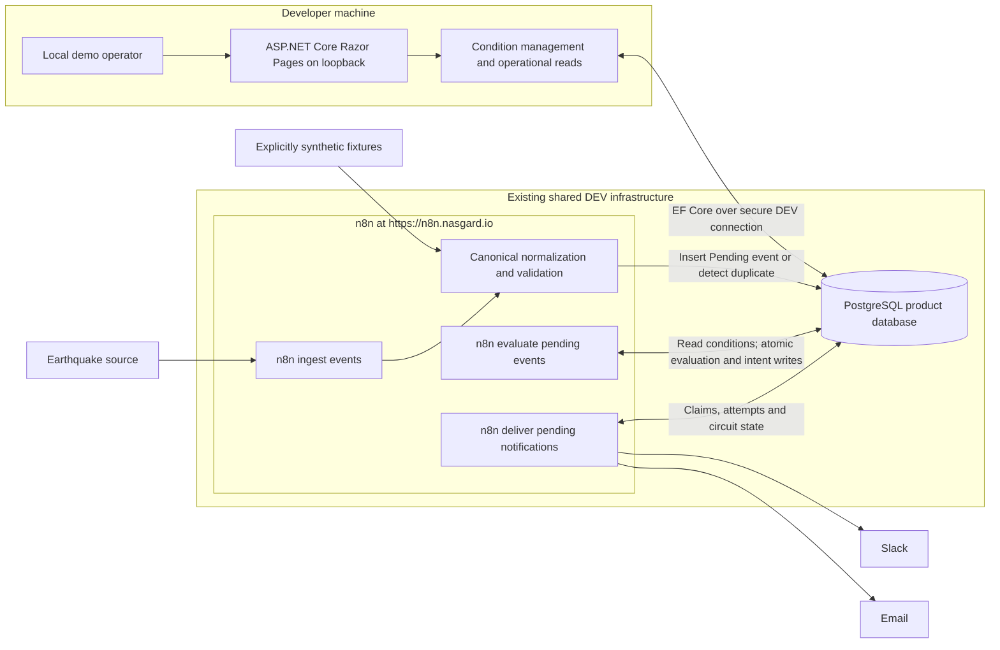

# MVP architecture

This is the milestone 2 product design, amended during milestone 3 preparation for the existing shared DEV environment under [ADR-006](adr/ADR-006-use-existing-shared-dev-infrastructure.md). The product is not implemented. The user's corrected boundary in [ADR-005](adr/ADR-005-direct-database-integration-and-workflow-owned-delivery.md) remains authoritative for processing: the application manages conditions and presents the UI; n8n owns event processing and notification workflows and accesses the product database directly. There is no n8n/application HTTP integration.

## Product and runtime shape

A demo user configures an enabled earthquake alert with a magnitude threshold and one or both of the configured email/Slack destinations. n8n ingests events, evaluates supported conditions, records durable notification intent, and sends notifications with retry and circuit breaking. The admin sees events and delivery outcomes. Additional event types reuse the same supported contract and processing stages.

Run the ASP.NET Core/Razor Pages application locally on the developer machine, directly or in the requested application-only Docker container with loopback host publishing. Use the existing shared DEV PostgreSQL server for the product database and the existing n8n runtime at `https://n8n.nasgard.io`. Do not provision local PostgreSQL or n8n. Hosted n8n owns its internal persistence entirely outside this repository; its storage is not part of the application database design. EF Core migrations own only the product schema. Confirm compatible application/provider versions and secure product-database connectivity during skeleton implementation; inspect n8n capabilities when relevant without changing shared service configuration. The service locations are user-confirmed, not connectivity test results.

The diagram shows the future product flow; milestone 3 implements no product workflows. The three scheduled responsibilities share the existing hosted n8n runtime. Its internal persistence is outside this diagram and product contract. Shared validation/transport steps may be reusable sub-workflows where they prevent duplication or permit independent tests. No generic workflow engine, broker, distributed cache, or extra worker service is needed.

## Responsibility and database access

| Component | Responsibility | Access boundary |
| --- | --- | --- |
| Razor Pages/application services | Create/edit/enable/disable user conditions, validate configuration, enforce demo ownership/roles, and render operational data. | Reads/writes configuration; reads workflow-owned event/delivery state. No event evaluator, delivery scheduler, or circuit state machine in application code. |
| n8n ingestion | Poll the selected source, normalize/validate canonical data, and persist previously unseen events. | Dedicated runtime credential for product SQL; external credentials use n8n's credential system. |
| n8n evaluation | Read active conditions, evaluate the supported typed rule, create unique delivery intent, and complete event processing. | One short atomic database operation per event. No direct external notification call while this transaction is open. |
| n8n delivery | Obtain due work, implement retries/circuit breaking, send email/Slack, and persist attempts/outcomes. | Workflow-owned logic and operational records. Application database storage does not imply application behavioral ownership. |
| Product PostgreSQL database | Configuration, canonical events, processing state, delivery/attempt records, and per-profile circuit state. | EF migrations own schema. n8n runtime can read configuration and read/write operational records; it cannot alter schema or user conditions. |

Use distinct least-privilege migration, application-runtime, and n8n product-workflow roles for the product database. [ADR-007](adr/ADR-007-accept-current-dev-database-access.md) permits the currently supplied application administrative credential for DEV only; production retains the restricted-role requirement. Outside that explicit DEV exception, runtime roles receive no schema-owner or superuser privileges; EF migration access is separate. Hosted n8n internal storage and its credentials are outside repository design, setup, and validation. Explicit column projections, parameterized values, and database constraints form the integration contract. Review every breaking schema change with the affected workflow queries. Do not build a duplicate application API for symmetry.

## Management, ownership, and destinations

The local demo has pre-created user and admin identities. Use an explicit Development-only demo identity selector producing the selected identity/role; do not build signup, password reset, OAuth, or a full identity platform. The selector is an operator convenience, not proof of identity. Starting this demo mode outside the intended Development/local environment must fail until an appropriate access design exists. Keep the local management UI on loopback. The hosted n8n editor uses its existing externally managed access controls; the previous loopback-only editor assumption is superseded by ADR-006. Application and future product-workflow database connections follow the shared DEV access requirements, with the current application credential and observed PostgreSQL TLS limitation accepted under ADR-007. Secure transport must be established before production use. This change does not implement or broaden application identity features.

The management surface lists the selected user's alerts and supports creation, editing, and enabling/disabling. Validate ownership on each operation. An alert has an owner, name, enabled flag, event type, one supported field/operator/typed-value condition, and selected delivery destinations. The initial supported rule is earthquake magnitude greater than or equal to a finite numeric threshold. Do not invent scientific range limits or restrict the configured threshold to provider-side feed filters. Reject unsupported fields/operators, invalid values, and empty destination selections.

Use one operator-configured Slack workspace/profile and one email sender/profile, with allowlisted demo destinations. An alert selects at most one destination per channel. Credentials and arbitrary URLs are not user rule fields. Initial destination provisioning is external/local configuration; self-service destination onboarding and multi-workspace OAuth are deferred. Validate and escape display/message text; source content cannot become HTML/script, executable SQL, or agent instructions. Use normal form anti-forgery protection even in the local UI.

Disable rather than hard-delete alerts so historical deliveries remain inspectable. Changes affect later evaluation; already committed notification content/destination snapshots do not silently change. No historical rematching UI or mass replay is included.

## Canonical event and rule contract

This is a conceptual contract, not a migration or finalized provider schema:

| Field/concept | Meaning |
| --- | --- |
| Contract version | One supported version initially; unsupported input is rejected, not guessed. |
| Source key | Stable configured provider identity, separate from event type. Demo sources use a reserved namespace. |
| External event identifier | Nonempty stable identifier within that source. Source plus external identifier is unique. |
| Event type | Initially earthquake. A redundant category hierarchy is unnecessary for one type. |
| Occurrence time | Required timestamp with an explicit UTC interpretation. |
| Title | Required bounded plain-text display title. A summary is optional; exact size bounds are input-contract configuration before implementation. |
| Source URL | Optional validated HTTP(S) reference for display, never an arbitrary fetch instruction. |
| Type-specific data | Validated earthquake magnitude as a finite number. Wire/storage JSON is allowed, but only supported typed fields may be used by conditions. |
| Received time and processing status | Set by the workflow/database boundary, never trusted from external content. |
| Synthetic marker | Derived from a reserved demo source/profile and shown in UI/notifications. It cannot be silently mixed with a live-source claim. |

Reject malformed or unsupported input before accepting an event; missing magnitude is not zero and must not accidentally match. For the supported contract, configure explicit payload/text bounds before implementing ingress. This is validation work, not permission to select a large schema framework.

Separate provider normalization from event semantics. Another earthquake provider maps to the same canonical type and condition. A new type declares its validated fields and allowed comparisons. A new business meaning, such as price movement over a time window, may need additional code/query logic. There is no arbitrary JSONPath, nested boolean language, or configuration-only promise for future domains. [ADR-002](adr/ADR-002-canonical-events-and-typed-alert-conditions.md) retains the extension rationale; ADR-005 replaces its original runtime ownership.

**Planning assumption for event updates:** retain the first valid accepted snapshot for a source/external identifier. Repeated polling, including changed provider content under that identifier, does not create a second event or re-evaluate a completed one. This follows the user's new-event flow and deliberately defers provider correction/retraction semantics. It can miss a later magnitude correction crossing the threshold; disclose this limitation in the demo and revisit before use where revisions matter. Different providers reporting the same occurrence are not cross-source deduplicated.

**Rule timing assumption:** evaluate the enabled rules visible in the atomic evaluation operation. A rule created/edited before a pending event is evaluated can affect that event; completed events are not retrospectively matched. The first source poll may include events already present in the provider's bounded feed window. No additional archive/backfill is requested. Providers and polling windows must be chosen with that behavior visible, not presented as a real-time completeness guarantee.

## Three recoverable workflow responsibilities

### 1. Ingest events

Schedule → fetch source → normalize/validate → insert a unique Pending event if absent. A duplicate may be skipped by this ingestion step, but event completion is not inferred from its existence. Invalid events are reported through workflow failure visibility. A source outage fails ingestion observably without preventing the other scheduled responsibilities from running. Poll frequency/window and any source cursor are adapter configuration selected with the provider; repeated results are safe.

### 2. Evaluate pending events

Independently scan Pending events, including records left by earlier failed executions. For each event, lock/conditionally acquire its unfinished row and execute the supported condition evaluation, insert the required unique delivery intents, and mark the event Evaluated in **one PostgreSQL transaction within one n8n database operation**. A non-match is also a completed evaluation. A failure rolls back the complete operation and leaves the event pending for a later run.

For this small rule set, execute deterministic matching and intent insertion as parameterized SQL owned by the workflow, using the documented allowlist of typed comparisons. Evaluate rules from one consistent statement snapshot; do not assemble matches from unrelated per-alert reads across nodes. This avoids a separate application matcher and the crash gap between per-alert inserts and an eventual completion marker. The concrete query and query-batching behavior must be verified against real PostgreSQL/n8n during implementation.

A uniqueness constraint on event, alert, and channel prevents repeated intent creation. Each delivery snapshots the relevant event display data, matched condition, destination, and logical transport profile. No further message broker or separate match table is required: the delivery records identify matched alerts, and Evaluated with no deliveries explains a non-match. SQL uses only supported fields/operators, never user-supplied query fragments.

The [n8n Postgres node documentation](https://github.com/n8n-io/n8n-docs/blob/main/docs/integrations/builtin/app-nodes/n8n-nodes-base.postgres/README.md) documents parameterized queries and transactional batching. That capability does not make a multi-node workflow atomic. This design requires the entire evaluation completion boundary to be one verified operation.

### 3. Deliver pending notifications

Independently schedule due Pending notifications. n8n reads and updates its operational delivery/circuit records directly in the product database; no application authorization, HTTP claim/callback, retry code, or circuit code participates.

| Delivery state | Meaning |
| --- | --- |
| Pending | Persisted intent waiting for its due time and an available transport circuit. |
| Processing | A bounded attempt holds an ownership token/lease. |
| Sent | A successful external transport acknowledgement has been durably recorded. It does not prove inbox placement or human receipt. |
| Failed | A permanent message/destination problem requires operator correction; the record remains inspectable. |

Claim a due delivery and profile permission atomically, using a stable attempt identity generated before the database call. At most one unexpired leased attempt per transport profile is sufficient for the demo. This is a logical ownership limit, not a guarantee that an expired slow external send has physically stopped. Select due work by next eligibility and stable creation order so a repeatedly failing item does not starve other due deliveries. Commit the claim before the external send, which must have a bounded timeout. Persist the attempt outcome and delivery/circuit transition atomically afterward. Do not hold a SQL transaction open across a network call.

Database retries repeat the same operation identity. A lost claim response must not allocate unrelated extra work. A retried success write must not send the message again. The actual transport node performs one send per attempt; disable independent send-node retries and route later attempts through the workflow gate. Every recovery path, including error workflows and manual execution retries, must return through the persisted claim gate. Do not replay an old send node with saved inputs as a fresh attempt.

Recover expired leases as uncertain outcomes in subsequent scheduled delivery runs. Expiry can mean n8n stopped before sending, so it does not increment a Closed circuit's dependency-failure count. A reported transport timeout/unavailability may count; an expired Half-open probe instead follows the separate conservative reopen rule. Retry uncertain or transient external failures with capped backoff; the user explicitly accepts possible duplicate messages. Sent is monotonic: a delayed success can prevent future attempts but cannot retract a newer external send already in flight. Stale failures cannot overwrite a recorded success or alter a newer probe. Preserve attempt history with sanitized errors and provider references where available.

Permanent destination errors fail that delivery without blocking other destinations. Shared dependency failures affect the corresponding circuit. Operator recovery is performed through a bounded n8n maintenance workflow/runbook after correction, reusing the existing delivery identity; the application admin remains observational. No record is silently deleted or expired because its provider is down.

## Workflow-owned circuit breaker

Persist the circuit state in workflow-owned operational records in the product database, separate from alert configuration. EF migrations may create these records' schema, and the admin may display them; all state-machine behavior remains in n8n workflows. Hosted n8n internal persistence is outside the product contract; neither that storage nor per-execution memory is the source of truth for product circuit state.

Scope the circuit to a configured transport profile, initially one Slack workspace/credential profile and one email sender profile. Opening Slack must not open email. Use a small state machine:

- **Closed:** eligible attempts proceed; count consecutive qualifying dependency failures.
- **Open:** preserve Pending deliveries and do not call the provider before recovery time. Waiting consumes no send attempt.
- **Half-open:** atomically permit one actual due delivery as a probe. A successful send closes/reset the circuit; a qualifying failure or expired uncertain probe reopens it.

Each attempt updates circuit accounting at most once. Use profile ownership/probe identity so late outcomes cannot close or reopen a newer circuit generation. Rate limits respect Retry-After when available. Authentication/configuration failures for a shared profile pause it for correction and controlled later probing. A permanent destination rejection is a neutral health outcome: fail that delivery, release the probe, keep Half-open without an active probe, and let the next eligible delivery probe. It neither closes the circuit nor leaves its probe slot occupied. If no delivery is due, Half-open simply waits; it holds no lease or database transaction.

This adapts the [Circuit Breaker pattern](https://learn.microsoft.com/en-us/azure/architecture/patterns/circuit-breaker) to workflow-owned state. It introduces no Azure service or mandatory resilience package. [n8n Retry On Fail](https://github.com/n8n-io/n8n-docs/blob/main/docs/integrations/builtin/handle-rate-limits.md) repeats a request, so enabling it blindly on transport nodes would bypass the shared gate.

### Proposed local defaults, not product SLAs

| Setting | Initial demo value | Reason/constraint |
| --- | --- | --- |
| Failure threshold | 3 consecutive qualifying dependency failures | Small deterministic circuit demonstration; not inferred from measured traffic. |
| Open cooldown | 60 seconds, or longer provider Retry-After | Avoid immediate repeated calls to a failing dependency. |
| Half-open concurrency | 1 probe per profile | Bound recovery and make concurrent scheduling testable. |
| Transport call timeout | 30 seconds | Must be enforced by the selected node/provider integration. |
| Attempt lease | 120 seconds | Must exceed bounded send duration plus outcome-write allowance. Revalidate against actual node behavior. |
| Delivery retry delay | 5 seconds, doubling to a 300-second cap | Deterministic backoff; circuit and provider delays take precedence. |
| Evaluation/delivery scheduling | Every 10 seconds for the local demo | Recovery progresses without new source events. Source polling has its own provider-dependent cadence. |

Transient/uncertain retries have no arbitrary terminal attempt count in this design; capped delay, bounded concurrency, and the circuit control repeated calls. Permanent failures remain visible. These are configurable engineering assumptions for implementation/review, not guaranteed delivery latency or a promise that unavailable services eventually recover. The user's five-send example expressed duplicate tolerance, not a numeric retry limit.

## Operational admin and deterministic demo

The admin surface shows recent events and processing state, linked deliveries, attempts/errors, next retry eligibility, and circuit state/recovery time. Display occurrence time and synthetic markers. Show n8n execution references where recorded, but do not replicate its workflow debugger or imply that an old last-event timestamp proves source failure.

Use controlled synthetic canonical events through the same normalization/validation and persistent processing boundary as real source data. Reserve synthetic source IDs, use distinct IDs per demo case, and restrict injection to an explicit operator-controlled manual entry in this project's n8n workflows. Keep this project's live ingestion disabled during deterministic runs and use only authorized allowlisted email/Slack destinations. Replay the same synthetic ID to prove deduplication; use a new ID to demonstrate another legitimate notification. No direct database insertion of finished matches or Sent records is a demo shortcut.

Retain product events, attempts, and delivery identity for the demo until an explicit operator reset of the isolated demo dataset. No automatic retention cleanup is included, because deleting deduplication keys could permit resend on replay. Hosted n8n execution retention is externally managed and outside this repository; product state remains authoritative. Any future demo reset must target only an explicitly isolated product dataset and leave unrelated shared DEV data and workflows untouched. Long-running retention, expiry of stale notifications, and production operational budgets remain future decisions.

## Configuration and remaining integration decisions

Connection-string values are absent from tracked files, including examples, migrations/helpers, prompts, logs, and exports. Application runtime and EF tooling use User Secrets locally. The requested application-only Docker option loads runtime settings from an ignored `.env`; shared PostgreSQL/n8n remain external. Future n8n product-database and notification credentials use its credential store; internal-storage credentials are outside this repository's scope. In the skeleton, missing or invalid product-database settings leave the shell and liveness running while readiness reports Unhealthy. Missing settings produce a startup warning naming the key; connection failures use sanitized health descriptions. There is no embedded fallback or secret-bearing diagnostic.

Provider selection, usable stable IDs and feed window, polling quotas, sender/workspace setup, transport error mapping, and compatible supported versions must be verified in their implementation milestones. The DEV service topology is selected under ADR-006. The skeleton specification pins compatible application packages; [the validation record](../evidence/reviews/2026-09-14-skeleton-review.md) distinguishes actual MCP connectivity from application readiness. No event provider, notification account, or executable product workflow is selected or configured here. Before implementation, review the explicit first-snapshot/update and current-rule timing assumptions against the intended demo.
