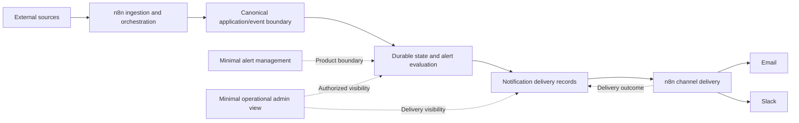

# Initial architecture direction

This is a conceptual direction, not a completed design. Nothing shown below is implemented. [ADR-001](adr/ADR-001-use-n8n-for-orchestration.md) records the accepted use of n8n; custom application shape, UI stack, persistence technology, schemas, and APIs remain open.

## Intended flow

Boxes represent responsibilities, not separate services, databases, deployable units, endpoints, or selected UI screens. Arrows describe intent; they do not choose push versus pull or a protocol. Notification delivery records are durable product state; their separate box clarifies their role without selecting separate storage.

## Responsibility boundaries

| Area | Intended responsibility | Limit |
| --- | --- | --- |
| External sources | Supply data from the subsequently selected source systems. | Content is untrusted; no source is selected and source claims are not product truth by default. |
| n8n ingestion/orchestration | Schedule polling or receive webhooks, call external systems, perform integration mapping, and invoke the canonical boundary. | Avoid growing workflow branches into an implicit domain layer. Ingestion mode and concrete mappings remain open. |
| Custom application boundary | Validate canonical events and own domain rules, matching, product APIs, and persistence boundaries where needed. | No event schema, API contract, language, or project topology is selected. |
| Durable product state | Retain the state needed for alerts, accepted events, evaluation, and recovery. | Exact records, transactions, concurrency behavior, database, and retention remain design work. Do not rely on transient execution state. |
| Notification delivery records | Represent intended deliveries and their outcomes so duplicate handling and recovery can be explicit. | Identity, transitions, retry ownership, and reconciliation are unresolved contracts. |
| n8n channel delivery | Execute email/Slack transport, manage integration credentials, and report outcomes across the product boundary. | Transport should not decide which alerts match or silently become the source of durable delivery truth. |
| Management/admin surfaces | Provide the minimum agreed user and operator journeys through the product boundary. | Technology and exact scope are open. n8n execution visibility may help operators but does not settle the product admin requirement. |

## Reliability direction

Define validation and idempotency at ingestion and delivery boundaries. Repeated ingestion, concurrent evaluation, workflow retries, application restarts, and transport failures must have explicit outcomes in the later contracts and tests.

A transport can accept a message while its acknowledgement is lost. Durable records and retries alone do not establish exactly-once recipient delivery. Decide how to handle unknown outcomes and acceptable duplicate risk before implementing delivery. Coordinate n8n retry behavior with the application's durable delivery policy so retries do not multiply unintentionally.

Keep workflows small, use reusable sub-workflows when they reduce repetition, review exported JSON in Git, and keep domain logic outside complex visual branching where practical. Workflow exports and execution logs need review for sensitive data. These controls are part of the [validation strategy](05-validation-strategy.md).

## Decisions still needed

Evaluate at least ASP.NET Core Razor Pages or another small server-rendered UI, native JavaScript/TypeScript with an HTTP API, and Angular. Compare actual interaction needs, maintainability, testing, and build/operational cost. There is a bias toward the smallest solution; no option is selected. A Razor Pages candidate does not select .NET for the application.

The [question register](02-assumptions-and-open-questions.md) also keeps event shape, matching, sources, durable persistence, user ownership, authorization, admin visibility, scale, retention, and delivery contracts open. Resolve the dependencies for the first executable slice in the future architecture milestone; do not introduce speculative infrastructure to fill the gaps.
