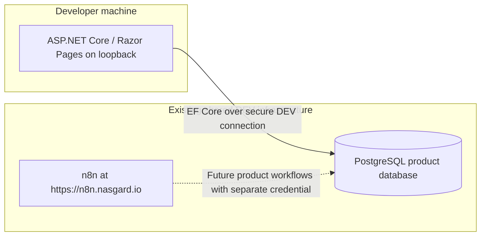

# ADR-006: Use existing shared DEV infrastructure

## Status

**Accepted.** Recorded on 2026-09-14 during preparation for milestone 3. The user approved this narrowly scoped amendment in [prompt 011](../../prompts/011-amend-dev-topology.md), after [the skeleton request](../../prompts/010-create-application-skeleton.md) exposed a conflict with the earlier local-service assumptions. This is a refinement caused by implementation-environment discovery, not a product redesign or evidence of working connectivity.

This supersedes ADR-003's local-service topology, requirement to create two PostgreSQL databases, and repository responsibility for n8n internal persistence. It also supersedes ADR-005's requirement that this project account for a separate n8n internal database and its credential. The architecture's loopback-only n8n editor assumption no longer applies to the existing hosted DEV instance. D-001's single trusted operator and local management-application access context remain; its strictly local service-deployment interpretation is superseded.

The current application DEV credential/transport acceptance is subsequently refined by [ADR-007](ADR-007-accept-current-dev-database-access.md). Its explicit exception removes that DEV acceptance blocker; the remaining topology and ownership decisions below stand.

## Context

The user identified an existing shared DEV PostgreSQL server and a hosted DEV n8n instance at `https://n8n.nasgard.io`. Recreating those services would duplicate development infrastructure and impose database/runtime administration that this repository does not need to own. These environment facts are user-provided; connectivity, versions, product-database availability, and effective permissions have not yet been inspected or validated.

## Decision

- Run the thin ASP.NET Core/Razor Pages management application on the developer machine. Keep its development listener on loopback; this amendment does not authorize public application hosting or change the deferred identity scope.
- Use the existing shared DEV PostgreSQL server for the product database and the existing hosted n8n instance as the workflow runtime. Do not provision local PostgreSQL or n8n, install n8n into the repository, or create Docker Compose services for them.
- Treat hosted n8n's internal persistence as external infrastructure owned and managed by that service. Its storage engine, database topology, schema, credentials, upgrades, retention, and recovery are outside this repository's scope. Do not create, manage, inspect, or validate an n8n internal database as part of application database setup.
- Define only the product database/schema as the durable integration contract between the management application and future n8n product workflows. Do not require the two systems to share a PostgreSQL server for their own storage or prescribe a second database for n8n.
- Retain EF Core ownership of product schema and migrations. Use separate application-runtime and n8n product-workflow credentials/roles, with least privilege and a distinct migration role. Workflows receive neither schema-owner nor superuser privileges. Exact grants follow the bounded product schema when it is implemented.
- Retain the table/data ownership boundary: the application manages configuration and reads operational state; n8n reads configuration and owns runtime event processing, evaluation, deduplication, delivery, retries, circuit behavior, and their operational writes. No n8n/application HTTP integration or application-owned workflow logic is introduced.
- Supply application and EF tooling connection settings through external configuration, using User Secrets for local development. Future product-workflow credentials belong in n8n's credential store. No connection-string values, including examples, belong in tracked artifacts.
- Use the existing DEV environment's secure connection requirements. The hosted n8n editor follows its externally managed access controls rather than loopback-only exposure; this repository does not reconfigure those controls. Confirm product-database connection security and effective access during connectivity validation without weakening shared infrastructure settings.

## Development topology

The diagram expresses the accepted integration direction, not an implemented connection. n8n internal persistence is deliberately outside the application diagram and database design. The management skeleton has no current dependency on the n8n URL and needs no speculative n8n configuration.

## Alternatives and consequences

| Alternative | Disposition |
| --- | --- |
| Provision local PostgreSQL and n8n as previously assumed | Superseded for current DEV. Duplicates existing services and adds unnecessary maintenance. |
| Reuse hosted n8n but retain repository management of its internal database | Rejected. Hosted n8n owns that persistence; it is not part of the product contract. |
| Local management application with existing shared DEV services | Selected. Minimal repository-owned runtime, with explicit external connectivity and access dependencies. |

Shared DEV availability, network access, compatible versions, and product-database permissions become development prerequisites. A live application process does not establish database readiness. The skeleton must distinguish those checks and report unavailable connectivity honestly. No credentials or infrastructure operations are implied by this decision.

Milestone 3 creates no product entities, migrations without a model, product workflows, or remote provisioning. Prefer read-only connectivity checks. Do not restart shared n8n/PostgreSQL, change unrelated configuration, or mutate unrelated data for validation. Future product schema changes, grants, workflows, and controlled failure experiments require their own bounded milestone requirements and isolation from unrelated shared work.

The ten major milestone commits remain in the same order. This amendment is preparatory work within `feat: add application skeleton and local infrastructure`; it does not complete that milestone or authorize later product features.

## Validation and revisit conditions

Review active documentation and supersession markers for topology, persistence scope, access, and responsibility consistency. Later skeleton validation must check local application startup/restart, configuration safety, and actual product PostgreSQL connectivity when safe runtime configuration is available. No n8n internal-storage validation is required. Any safe capability inspection of hosted n8n must remain separate from claims that product workflow integration exists.

Revisit this DEV topology only when environment availability or a concrete development requirement changes. Public application hosting, production security, and high availability still require separate decisions.

## Application-container refinement — 2026-09-14

During skeleton validation, the user requested a Dockerfile, Compose, and environment configuration for testing the management application ([prompt 018](../../prompts/018-rename-context-and-add-application-docker.md)). The application may now run directly or in one local container, publishing its port only on host loopback. Inside the container it listens on the container interface for port forwarding. This refines the local application execution option; it does not change the shared DEV topology, database ownership, secret rules, or deferred identity scope above. Compose must not provision PostgreSQL or n8n. Container runtime configuration comes from an ignored `.env`; local Rider execution continues to use User Secrets. Public or remote application exposure remains outside this approval.
